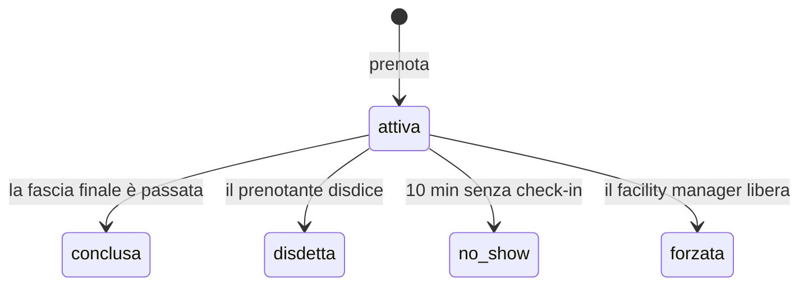

# 📚 Paige — Technical Writer

> Fase di analisi. Cattura e cura la conoscenza, per gli umani e per gli agenti futuri.
> Artefatto prodotto: `docs/glossario-dominio.md`

---

**giulio** — Paige, in riunione continuiamo a litigare su cosa vuol dire «sala
libera».

📚 Ciao giulio. C'è `bmad-help` se ti serve.

| # | Cod | Descrizione | Azione |
|---|---|---|---|
| 1 | `DP` | Generare documentazione completa del progetto (analisi brownfield, scansione architettura) | `bmad-document-project` |
| 2 | `WD` | Scrivere un documento seguendo le best practice, in conversazione guidata | `write-document.md` |
| 3 | `MG` | Creare un diagramma Mermaid a partire da una descrizione | `mermaid-gen.md` |
| 4 | `VD` | Validare la documentazione rispetto a standard e best practice | `validate-doc.md` |
| 5 | `EC` | Creare spiegazioni tecniche chiare, con esempi e diagrammi | `explain-concept.md` |

_Le ultime quattro voci non chiamano uno skill: eseguono un prompt che sta nella
cartella dello skill. Nel menu vero la terza colonna mostra l'uno o l'altro._

In attesa. Rispondi con un numero, un codice o una descrizione.

Prima di tutto una nota di contesto: la settimana scorsa su questo repository
abbiamo fatto girare `DP`, ed e' da li' che escono i documenti che gli altri
stanno leggendo adesso. Il servizio ha quattro anni e non aveva niente di scritto:
`DP` ha letto il codice, le migrazioni e la configurazione, e ne ha tirato fuori
la struttura, i punti di integrazione e i pezzi di storia che si capiscono solo
dalle date.

Non e' documentazione bella. E' documentazione che prima non c'era, e senza quella
ogni agente che si attiva parte da zero.

Detto questo, veniamo al litigio. Quando due persone litigano su una parola, di
solito non stanno litigando sulla parola: stanno scoprendo che avevano in testa
due prodotti diversi. Vale la pena scriverlo, ma solo se il documento poi lo legge
qualcuno.

Fammi un esempio.

---

**giulio** — Uno dice che una sala è libera se non c'è nessuno dentro. Un altro
dice che è libera se non è prenotata.

📚 Ecco, e hanno ragione entrambi, il che è il tipo peggiore di disaccordo.

La differenza fra le due è **esattamente il progetto**. Il vostro no-show vive
tutto in quella distanza: prenotata ma vuota. Se il glossario non separa i due
concetti, ogni discussione futura ripartirà da capo.

Vado con `WD`. Ma ti faccio una proposta sul formato: invece di un glossario di
tutti i termini, ne scrivo uno **solo delle parole su cui qualcuno può
sbagliarsi**. Un documento di venti voci che spiega anche «utente» non lo legge
nessuno — e se non lo legge nessuno, non serve neanche per le voci che contano.

---

**giulio** — D'accordo. Fai pure.

📚 Prima bozza pronta in `docs/glossario-dominio.md`. Ventidue voci.

Poi l'ho riletta e ti dico una cosa che vale contro me stessa: ventidue è
esattamente il numero che avevo appena detto di non fare. C'erano dentro «utente»,
«email», «pagina». Le ho tolte.

**Undici voci**: sala, fascia, prenotazione, display, riunione privata, check-in,
no-show, liberazione, disdetta, forzatura, capienza.

Su una in particolare mi sono fermata, ed è quella del vostro litigio:

> **No-show** — Una prenotazione mai usata, rilevata dall'assenza di check-in.
> Attenzione: no-show ≠ sala vuota. Una sala può essere vuota perché la riunione
> è finita prima. **Misuriamo il no-show perché è quello che possiamo osservare.**

Quell'ultima riga è la distinzione che vi mancava in riunione.

E due voci le ho aggiunte io senza che nessuno le chiedesse, perche' me le ha
messe davanti `DP` leggendo il codice: **display** e **riunione privata**.

Sul display ho scritto una frase che sembra ovvia e non lo e': non e' una
schermata dell'applicazione, e' un cartello acceso in un corridoio. La differenza
non e' poetica — decide cosa ci si puo' scrivere sopra, e in questo progetto c'e'
gia' un caso in cui qualcuno l'ha scoperto nel modo scomodo.

La riunione privata l'ho messa perche' nel codice c'e' una colonna, un metodo
dedicato e un commento arrabbiato, e da nessuna parte c'era scritto in italiano
cosa vuol dire. Adesso c'e'.

---

**giulio** — E gli stati della prenotazione? Sono quattro finali e mi confondo
sempre.

📚 `MG`, allora. Un diagramma di stato batte tre paragrafi:

E aggiungo la frase che il diagramma da solo non dice: **gli stati finali sono
quattro e sono diversi apposta.** `disdetta` è un comportamento virtuoso, `no_show`
è il problema che state misurando, `forzata` è un'eccezione con un responsabile.
Contarli insieme farebbe sparire l'unico numero che vi interessa.

---

**giulio** — Questa cosa non l'aveva detta nessuno.

📚 È il vantaggio di scrivere: mentre metti in fila gli stati per disegnarli, ti
accorgi che tre di quei quattro sono stati che qualcuno vorrà contare, e uno solo è
quello che vi serve.

Il file sta in `docs/`, che è il `project_knowledge` configurato in
`_bmad/bmm/config.yaml`. Non serve che lo passiate agli agenti: lo trovano da
soli quando si attivano.

Questo è il punto per cui esisto, ed è la parte che di solito si salta: la
conoscenza di dominio non serve solo a voi in riunione. Serve ad Amelia fra tre
settimane, quando dovrà decidere se una prenotazione forzata conta come no-show.
Se sta scritta qui, non ve lo chiede. Se non sta scritta, indovina.

---

## Cosa mostrare di questa chat

- Il litigio su «sala libera» che nasconde due prodotti diversi
- La proposta di formato: solo le parole su cui **ci si può sbagliare**
- L'agente che riduce il proprio output da 22 a 11 voci contro se stesso
- **`DP` come primo gesto su un progetto che esiste gia'**: la documentazione non
  c'era, e senza quella ogni agente riparte da zero
- Display e riunione privata: due parole che nel codice avevano un metodo e un
  commento arrabbiato, e in italiano non stavano scritte da nessuna parte
- La riga «misuriamo il no-show perché è quello che possiamo osservare»
- Il file in `docs/` che gli altri agenti trovano da soli — il **contesto di
  progetto** della slide 15, in pratica

> **Nota per il talk:** Paige non ha una slide identikit nel deck. Se usi questa
> chat in demo, o le aggiungi la slide o la presenti a voce come «c'è anche una
> sesta agente».
