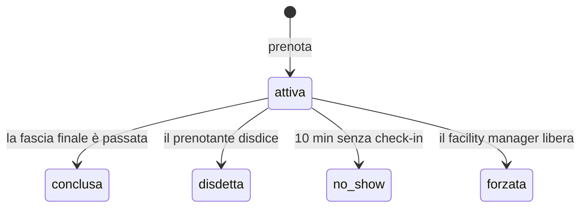

# 📚 Paige — Technical Writer

> Fase di analisi. Cattura e cura la conoscenza, per gli umani e per gli agenti futuri.
> Artefatto prodotto: `docs/glossario-dominio.md`

---

**giulio** — Paige, in riunione continuiamo a litigare su cosa vuol dire «sala
libera».

📚 Ciao giulio. C'è `bmad-help` se ti serve.

| # | Codice | Cosa |
|---|---|---|
| 1 | DP | Generare documentazione completa del progetto (analisi brownfield, scansione architettura) |
| 2 | WD | Scrivere un documento seguendo le best practice, in conversazione guidata |
| 3 | MG | Creare un diagramma Mermaid a partire da una descrizione |
| 4 | VD | Validare la documentazione rispetto a standard e best practice |
| 5 | EC | Creare spiegazioni tecniche chiare, con esempi e diagrammi |

Quando due persone litigano su una parola, di solito non stanno litigando sulla
parola: stanno scoprendo che avevano in testa due prodotti diversi. Vale la pena
scriverlo, ma solo se il documento poi lo legge qualcuno.

Fammi un esempio del litigio.

---

**giulio** — Uno dice che una sala è libera se non c'è nessuno dentro. Un altro
dice che è libera se non è prenotata.

📚 Ecco, e hanno ragione entrambi, il che è il tipo peggiore di disaccordo.

La differenza fra le due è **esattamente il progetto**. Il vostro no-show vive
tutto in quella distanza: prenotata ma vuota. Se il glossario non separa i due
concetti, ogni discussione futura ripartirà da capo.

Vado con `WD`. Ma ti faccio una proposta sul formato: invece di un glossario di
tutti i termini, ne scrivo uno **solo delle parole su cui qualcuno può
sbagliarsi**. Un documento di venti voci che spiega anche «utente» non lo legge
nessuno — e se non lo legge nessuno, non serve neanche per le voci che contano.

---

**giulio** — D'accordo. Fai pure.

📚 Prima bozza pronta in `docs/glossario-dominio.md`. Ventidue voci.

Poi l'ho riletta e ti dico una cosa che vale contro me stessa: ventidue è
esattamente il numero che avevo appena detto di non fare. C'erano dentro «utente»,
«email», «pagina». Le ho tolte.

**Nove voci**: sala, fascia, prenotazione, check-in, no-show, liberazione,
disdetta, forzatura, capienza.

Su una in particolare mi sono fermata, ed è quella del vostro litigio:

> **No-show** — Una prenotazione mai usata, rilevata dall'assenza di check-in.
> Attenzione: no-show ≠ sala vuota. Una sala può essere vuota perché la riunione
> è finita prima. **Misuriamo il no-show perché è quello che possiamo osservare.**

Quell'ultima riga è la distinzione che vi mancava in riunione.

---

**giulio** — E gli stati della prenotazione? Sono quattro finali e mi confondo
sempre.

📚 `MG`, allora. Un diagramma di stato batte tre paragrafi:

E aggiungo la frase che il diagramma da solo non dice: **gli stati finali sono
quattro e sono diversi apposta.** `disdetta` è un comportamento virtuoso, `no_show`
è il problema che state misurando, `forzata` è un'eccezione con un responsabile.
Contarli insieme farebbe sparire l'unico numero che vi interessa.

---

**giulio** — Questa cosa non l'aveva detta nessuno.

📚 È il vantaggio di scrivere: mentre metti in fila gli stati per disegnarli, ti
accorgi che tre di quei quattro sono stati che qualcuno vorrà contare, e uno solo è
quello che vi serve.

Il file sta in `docs/`, che è il `project_knowledge` configurato in
`_bmad/bmm/config.yaml`. Non serve che lo passiate agli agenti: lo trovano da
soli quando si attivano.

Questo è il punto per cui esisto, ed è la parte che di solito si salta: la
conoscenza di dominio non serve solo a voi in riunione. Serve ad Amelia fra tre
settimane, quando dovrà decidere se una prenotazione forzata conta come no-show.
Se sta scritta qui, non ve lo chiede. Se non sta scritta, indovina.

---

## Cosa mostrare di questa chat

- Il litigio su «sala libera» che nasconde due prodotti diversi
- La proposta di formato: solo le parole su cui **ci si può sbagliare**
- L'agente che riduce il proprio output da 22 a 9 voci contro se stesso
- La riga «misuriamo il no-show perché è quello che possiamo osservare»
- Il file in `docs/` che gli altri agenti trovano da soli — il **contesto di
  progetto** della slide 15, in pratica

> **Nota per il talk:** Paige non ha una slide identikit nel deck. Se usi questa
> chat in demo, o le aggiungi la slide o la presenti a voce come «c'è anche una
> sesta agente».
