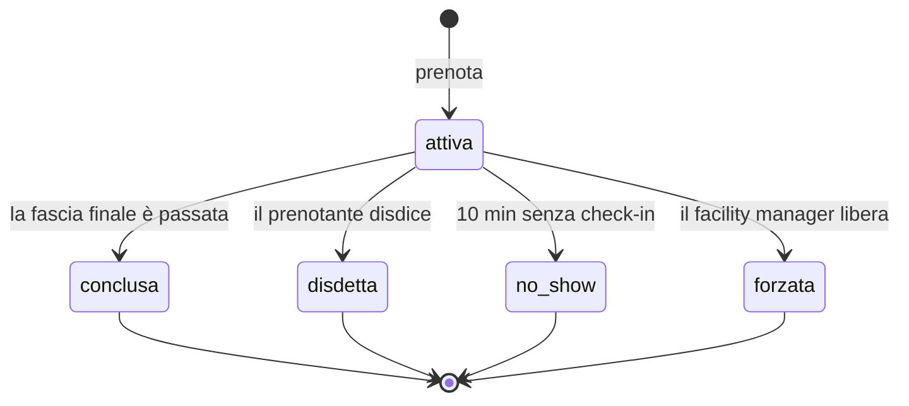

# Glossario di dominio — SaleRiunioni

Autrice: Paige (Technical Writer) · codice menu `WD`
Revisione umana: Giulio, 2026-08-27

> Sta in `docs/`, che è il `project_knowledge` configurato in
> `_bmad/bmm/config.yaml`. Gli agenti lo trovano da soli.

Undici parole. Se una discussione si impantana, quasi sempre è perché due persone
usano una di queste in due modi diversi.

## Sala

Uno spazio fisico prenotabile, identificato da un nome e una capienza. Le sale
non si creano dall'applicazione: arrivano dall'anagrafica del facility management
e per noi sono di sola lettura.

## Fascia

Uno slot da 30 minuti. È l'unità minima di prenotazione. Una riunione di un'ora
occupa due fasce contigue.

Non diciamo mai «slot», «blocco» o «orario»: sempre **fascia**. Il codice usa lo
stesso nome.

## Prenotazione

L'associazione fra una sala, un intervallo di fasce contigue e la persona che l'ha
richiesta. **Da noi è uno specchio**: l'originale è un evento sul calendario della
sala, su Outlook. Noi lo copiamo per poterlo mostrare e contare.

Ha un titolo, ed è il campo su cui si sbaglia: `titolo()` è il dato grezzo dello
specchio, non testo da mostrare.

Ha uno stato, e lo stato è il cuore del dominio:

Gli stati finali sono quattro e sono diversi apposta: `disdetta` è un
comportamento virtuoso, `no_show` è il problema che stiamo misurando, `forzata` è
un'eccezione con un responsabile. Contarli insieme farebbe sparire l'unico numero
che ci interessa.

## Display

Lo schermo appeso fuori dalla sala. Non è «una schermata dell'applicazione»: è un
**cartello acceso in un corridoio**, senza login, che legge chiunque passi —
colleghi, fornitori, candidati in attesa, chi fa le pulizie.

Lo diciamo così, con questa insistenza, perché la differenza fra «schermata» e
«cartello in corridoio» decide cosa ci si può scrivere sopra. Vedi
`architecture.md` § E3.

## Riunione privata

Una riunione che su Outlook chi la crea ha marcato come privata. Da noi arriva
nella colonna `privato`.

Non è una categoria tecnica: sono i colloqui, gli uno-a-uno, le riunioni
sindacali, le cose di cui esiste il fatto ma non il contenuto. **Il titolo di una
riunione privata non esce mai su un display.** Al suo posto si scrive «Riunione
riservata».

Chi scrive testo destinato all'esterno non deve ricordarselo: deve usare
`TestoDisplay`, che se lo ricorda al posto suo.

## Check-in

La conferma che qualcuno è davvero in sala. Si fa dall'inizio della prenotazione e
per i 10 minuti successivi. È un'azione, non uno stato: una prenotazione «ha il
check-in» oppure no.

## No-show

Una prenotazione mai usata, rilevata dall'assenza di check-in. **È il termine
centrale del progetto**: la ragione per cui l'applicazione esiste è far scendere
il numero di no-show.

Attenzione: no-show ≠ sala vuota. Una sala può essere vuota perché la riunione è
finita prima. Misuriamo il no-show perché è quello che possiamo osservare.

## Liberazione

Il passaggio automatico da `attiva` a `no_show`, con la sala che torna prenotabile
per le fasce residue — **anche su Outlook**, altrimenti l'abbiamo liberata solo
per noi e chi cerca una sala dal calendario continua a vederla occupata.

Non è una cancellazione: la nostra riga resta, con il suo stato, perché serve a
contare. E l'evento su Outlook resta: gli togliamo la sala, non lo cancelliamo.

## Disdetta

La liberazione volontaria, fatta dal prenotante prima della fine. Diversa dalla
liberazione automatica sia nello stato sia nel significato.

## Forzatura

La liberazione fatta dal facility manager su una sala occupata, con motivazione
obbligatoria. È l'unico caso in cui una persona agisce sulla prenotazione di
un'altra, quindi è l'unico che lascia sempre una traccia con un nome sopra.

## Capienza

Il numero massimo di persone della sala, dall'anagrafica. La ricerca la usa come
filtro (almeno i partecipanti richiesti) e come ordinamento (prima le più piccole
che bastano). Prenotare una sala da 12 in due è uno spreco quanto un no-show, ma
non lo impediamo: lo rendiamo solo meno probabile con l'ordinamento.

---

**Nota del revisore umano (Giulio):** la prima versione aveva ventidue voci,
incluse cose come «utente» e «email». Ho chiesto di tenere solo i termini su cui
qualcuno può sbagliarsi. Un glossario che spiega «utente» non lo legge nessuno, e
se non lo legge nessuno non serve neanche per le nove parole che contano.
